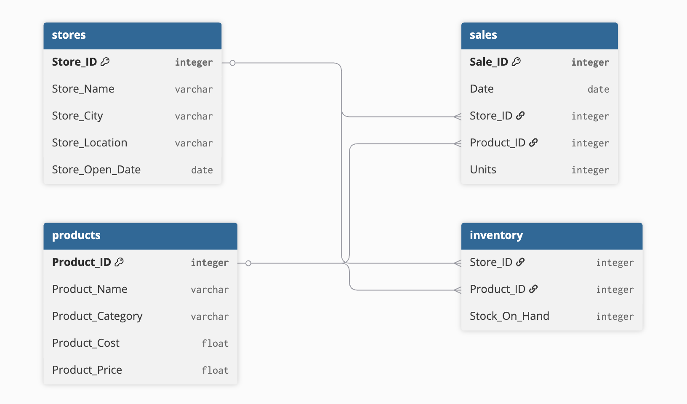

# Maven Toys Profitability & Expansion Analysis

## Project Background
Maven Toys is a fictitious toy store chain operating across Mexico, looking to expand with new store openings. As an external BI consultant, this analysis examines transaction, product, and store data across 50 locations to identify which categories, cities, and store profiles drive the most profit, and to provide data-driven recommendations on where and how Maven Toys should expand.

Insights and recommendations are provided on the following key areas:

* **Product Performance:** Analysis of revenue and profit margin across product categories to identify which products drive the most value and whether this is consistent across locations.
* **Store & Regional Performance:** Evaluation of store-level revenue and profitability across cities and location types to surface the highest-performing store profiles.
* **Seasonal Trends:** Identification of demand patterns across the year to inform inventory planning and new store launch timing.
* **Store Cohort Analysis:** Analysis of stores grouped by opening date to compare how different eras of expansion have performed and which profiles are most efficient on a per-store basis.
* **Expansion Recommendation:** A data-driven recommendation on which store profile Maven Toys should prioritise when opening new locations.

An interactive Tableau dashboard can be viewed [here](https://public.tableau.com/shared/MXSQGZFXC?:display_count=n&:origin=viz_share_link).

The Python notebook used for data cleaning, EDA, profitability analysis, SQL queries, and cohort analysis can be found [here](maven_toys_analysis.ipynb).

---

## Data Structure & Initial Checks

Maven Toys' database contains 4 tables covering products, stores, daily sales transactions, and current inventory levels.

| Table | Description | Rows |
|---|---|---|
| `sales` | Daily transaction records with product and store references | 829,262 |
| `products` | Product names, categories, cost, and retail price | 35 |
| `stores` | Store name, city, location type, and opening date | 50 |
| `inventory` | Current stock levels per product per store | 1,593 |

The dataset spans **1 January 2022 to 30 September 2023** across 50 stores and 35 products. Prior to analysis, checks were conducted for nulls, duplicates, and date range consistency across all tables. No data quality issues were found. Derived fields (revenue, profit, and margin %) were calculated by joining sales, products, and stores into a clean base table.

---

## Executive Summary

### The Business Problem
Maven Toys is planning to open new store locations and needs to understand which markets and store profiles are worth replicating. This analysis covers 829,262 sales transactions across 50 stores to identify the highest-value expansion opportunities by location type, city, and product mix.

### Methodology
Sales and product data were joined to calculate revenue (unit price × units sold) and profit (revenue minus cost) in USD ($). Margin % was calculated at the product level. Stores were grouped into cohorts by opening date to compare per-store efficiency across different eras of expansion. All figures use total values unless otherwise noted; per-store averages are used for cohort comparisons to control for group size.

Below is the overview page from the Tableau dashboard. The full interactive dashboard can be viewed [here](https://public.tableau.com/shared/MXSQGZFXC?:display_count=n&:origin=viz_share_link).

---

## Key Findings

| Metric | Value |
|---|---|
| Total Revenue ($) | 16,444,572 |
| Total Profit ($) | 4,014,049 |
| Overall Margin % | 28% |
| Highest Margin Category | Electronics (46%) |
| Highest Avg Profit per Store ($) | Airport (126,016) |
| Peak Revenue Month | December |
| Strongest City | Ciudad de Mexico |

- **Electronics** delivers nearly as much total profit as Toys despite selling less than half the units, making it the highest-margin category at 46%
- **Airport stores** average $126,016 profit per store, which is 63% more than Downtown, Commercial, or Residential locations (all within 1% of each other)
- **Ciudad de Mexico** accounts for 3 of the top 10 stores by profit despite having only 7 stores in the portfolio, reflecting a strong concentration of high-performing locations; Guadalajara and Monterrey follow closely
- **December is the peak month** across both years, with revenue spiking roughly 45% above the August low driven by Christmas demand
- **2023 outperforms 2022 in every single month** (January through September, the extent of available 2023 data), indicating the business is growing year over year across all store types and categories
- The **2000-2004 store cohort** generates the highest average profit per store at $88,489, outperforming newer cohorts on a per-store basis and likely reflecting the prime site selection decisions made during Maven Toys' earliest expansion phase

---

## Recommendations

Each recommendation is directed at informing Maven Toys' expansion strategy.

#### Prioritise Electronics in New Store Inventory
- At 46% margin, Electronics generates outsized profit relative to floor space and units sold
- New stores should allocate significant shelf space to Electronics from day one
- Limit investment in Sports & Outdoors (the weakest category at 22% margin) until local demand is established

#### Target Airport Locations in Major Cities
- Airport stores average $126,016 profit per store, the highest of any location type by a wide margin
- Only 3 Airport stores currently exist, making this the most underleveraged location type in the portfolio
- Priority markets for new Airport locations: **Ciudad de Mexico**, **Guadalajara**, and **Monterrey**, the three cities that dominate the top 10 store rankings

#### Open New Stores by October to Capture Peak Season
- December is consistently the highest revenue month at $877k in 2022 and the peak across both years
- New stores opened by October will have time to establish operations before the Christmas demand spike
- Ensure Electronics and Toys inventory is fully stocked entering November

#### Use the 2000-2004 Cohort as a Benchmarking Model
- Despite being the oldest active stores, the 2000-2004 cohort generates the highest avg profit per store at $88,489
- The location decisions made during that period have proven most durable, and new site selection should study what those stores have in common (city, location type, footprint)
- Avoid assuming newer stores will outperform; the data shows no correlation between store age and per-store efficiency

---

### Bottom Line
Maven Toys' strongest expansion opportunity is **Airport locations in Ciudad de Mexico and Guadalajara**, stocked with **Electronics and Toys**, opened by **October** to capture December peak demand. This profile combines the highest per-store profit type with the strongest city markets and the most efficient product mix, representing the clearest path to profitable growth.
